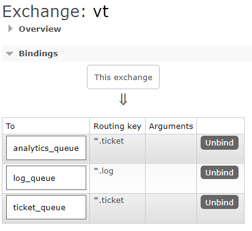

This is a POF to use [Next.js](https://nextjs.org) with [RabbitMQ](https://www.rabbitmq.com/)

## Set RabbitMQ

```bash
docker pull rabbitmq:management
docker run -d --name rabbitmq-management -p 5672:5672 -p 15672:15672 rabbitmq:management
docker ps
```
Go to [http://localhost:15672/](http://localhost:15672/)

* Username: guest
* Password: guest

Create Exchange named vt and queues 
* analytics_queue: *.ticket
* logs_queue: *.log
* ticket_queue:   *.ticket




## Run web app

First, run the development server:

```bash
npm run dev
```

Open [http://localhost:3000](http://localhost:3000) with your browser to see the result.

You can start editing the page by modifying `app/page.tsx`. The page auto-updates as you edit the file.